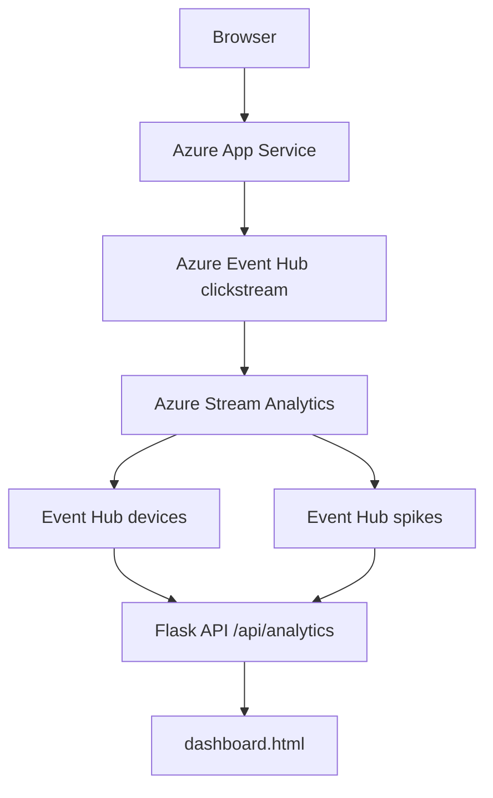

# CST8916 Assignment 2: Real-time Stream Analytics Pipeline

**Student Name**: Bosi Chen\
**Student ID**: 041040774\
**Course**: CST8916 Remote Data and Real-time Applications\
**Semester**: Winter 2026

---

## Demo Video

🎥 [Watch Demo Video](https://youtu.be/aHAqnWtKvUw)

---

## Architecture Diagram

## Design Decisions

**Event enrichments**

Firstly with the help of ChatGPT to get the code for getting the user device, browser and os information.

Enrich the `event` dictionary in the `track()` function. Added `deviceType`, `browser` and `os` key value pairs.

**Connecting Stream Analytics output to the dashboard**

Azure Event Hubs was chosen for storing the SAQL output. The output is stored in two separate Event Hubs, devices and spikes. 

The app.py reads the output via `/api/analytics`. The `dashboard.html` polls this endpoint and updates insights in the dashboard page.

## Setup Instructions

Azure Services

- Azure App Service – hosts the Flask web application
- Azure Event Hubs – receives clickstream events
- Azure Stream Analytics – processes the event stream and produces analytics results

Environment Variables

- EVENT_HUB_CONNECTION_STR=
- EVENT_HUB_NAME=clickstream
- EVENT_HUB_DEVICES=devices
- EVENT_HUB_SPIKES=spikes
